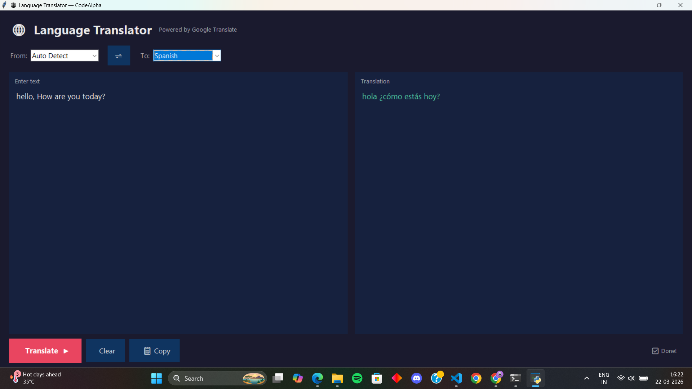

🌐 Language Translation Tool — 

A GUI-based Language Translation Tool built with Python as part of the **CodeAlpha AI Internship**.

Screenshot:


## ✨ Features

- 🌍 Supports 20+ languages including Hindi, Gujarati, Spanish, French, Arabic, Chinese and more
- 🔍 Auto-detect source language — no need to know the input language
- ⇌ Swap languages with one click
- 📋 **Copy to clipboard** button for quick use
- ⚡ **Non-blocking translation** — UI never freezes
- ⌨️ **Ctrl + Enter** keyboard shortcut to translate fast

---

 🛠️ Tech Stack

| Tool | Purpose |
|------|---------|
| Python 3.x | Core programming language |
| Tkinter | GUI window and widgets |
| deep-translator | Google Translate API wrapper |
| threading | Background translation (non-blocking) |

---

## 📦 Installation

1. Clone the repository
```bash
git clone https://github.com/your-username/CodeAlpha_LanguageTranslationTool.git
cd CodeAlpha_LanguageTranslationTool
```

2. Install dependencies
```bash
pip install -r requirements.txt
```

3. Run the app
```bash
python task1_translation_tool.py
```

---

🚀 How to Use

1. Type or paste any text in the left box
2. Select the source language (or keep Auto Detect)
3. Select the target language
4. Click Translate ▶ or press **Ctrl + Enter**
5. View the translated text in the **right box**
6. Use the **📋 Copy** button to copy the result

---
 📁 Project Structure

```
CodeAlpha_LanguageTranslationTool/
├── task1_translation_tool.py    # Main application code
├── requirements.txt             # Python dependencies
├── README.md                    # Project documentation
└── screenshots/
    └── app_screenshot.png       # App screenshot
```

---

 Author

Simran Dayma 
AI Intern at CodeAlpha  
LinkedIn : https://www.linkedin.com/in/simran-dayma-54151131a?utm_source=share_via&utm_content=profile&utm_medium=member_android
GitHub : (https://github.com/SimranDayma)


🏢 About CodeAlpha

CodeAlpha is a leading software development company providing internship opportunities in AI, web development, and more.  
🌐 [www.codealpha.tech](https://www.codealpha.tech)
